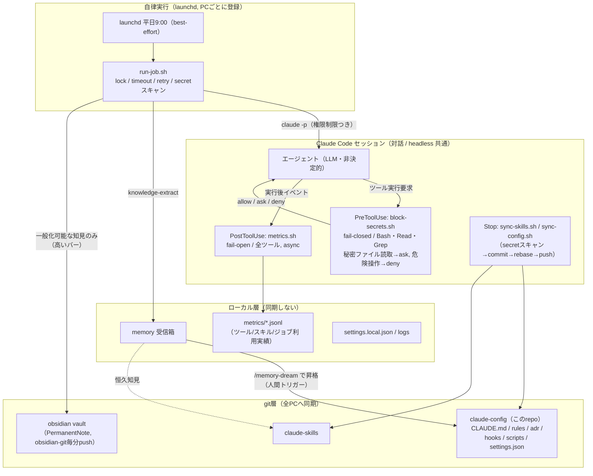
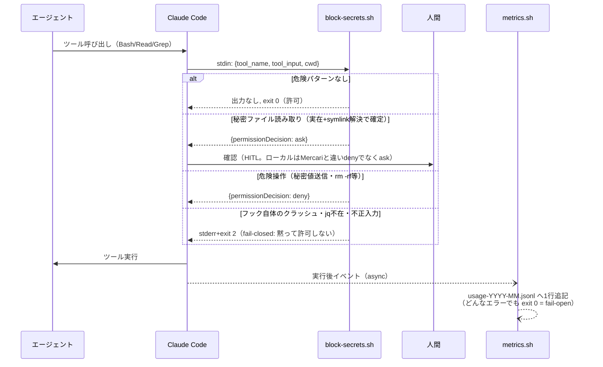
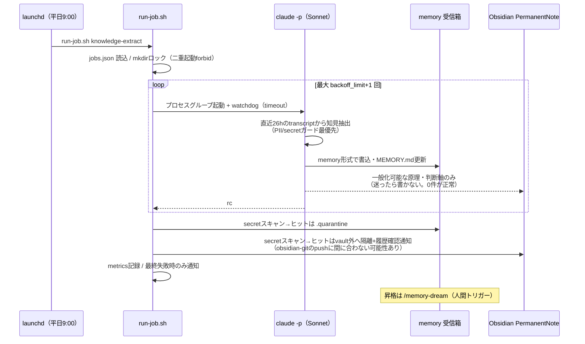

# claude-config

Claude Codeのグローバル設定(CLAUDE.md / rules / adr / hooks / scripts / settings)のgit管理。設計はADR-0001参照。skillsは別repo( https://github.com/mormorbump/claude-skills )。

## 別PCへのセットアップ

前提: git / gh / GitHubのSSHキー(mormorbumpアカウント)が使えること。

```bash
# 1) Claude Codeを一度起動して ~/.claude を生成しておく

# 2) 既存ファイルを退避(上書きされるのはtrack対象のみ)
cd ~/.claude
mkdir -p ../claude-backup && cp -a CLAUDE.md settings.json ../claude-backup/ 2>/dev/null

# 3) claude-config を既存の ~/.claude に重ねる
git init
git remote add origin git@github.com:mormorbump/claude-config.git
git fetch origin
git checkout -f -b main origin/main

# 4) skills を clone
git clone git@github.com:mormorbump/claude-skills.git ~/.claude/skills
```

## 手動対応が必要なもの(repoに含まれない)

- `rules/private/`: アカウント・身元関連のルール(git非トラック)。必要なら手動コピー
- `scripts/.env`: Discord Botトークン。必要なら安全な手段で個別コピー
- `~/.claude.json`: MCPサーバ設定はこのrepoの対象外(ADR-0001の既知の限界)。新PCで再設定
- `settings.local.json`: マシンローカルのpermission設定。必要なら再作成
- launchd(`com.mormorbump.claude-skills-sync`): skills定期syncを新PCでも回すなら `~/Library/LaunchAgents` にplistを別途作成
- launchd(`com.claude.job-knowledge-extract`): 日次ナレッジ抽出ジョブ(ADR-0002)。新PCでは `bash ~/.claude/scripts/jobs/install-launchd.sh` を1回実行(冪等)

## 日常の同期

- **skills**: Stop hook(`hooks/sync-skills.sh`)が自動で双方向sync(commit→rebase→push)
- **config(このrepo)**: Stop hook(`hooks/sync-config.sh`)が自動で双方向sync。commit前に追加行のsecretスキャンを行い、検出時はcommitを中止して通知する。rebase競合時も通知(手動解決)
- **履歴リライト(force push)への追従**: sync-config.shが共通祖先の消失を検出すると、ローカルを`backup-before-reset-*`ブランチに退避して`origin/main`へ自動`reset --hard`する。未トラックのローカルデータ(metrics/memory/logs)は影響を受けない

## アーキテクチャ

3層構造: **git層**(全PCへ同期される決定的な仕組み) / **ローカル層**(同期しない揮発データ) /
**昇格フロー**(知見だけが人間・ジョブの判断でgit層に上がり、結果的に同期される)。
セキュリティ層はfail-closed、計測層はfail-openと、層ごとに逆へ倒す(詳細はADR-0002)。



### シーケンス: ツール実行1回のフック処理



### シーケンス: 自律ジョブ（knowledge-extract）


