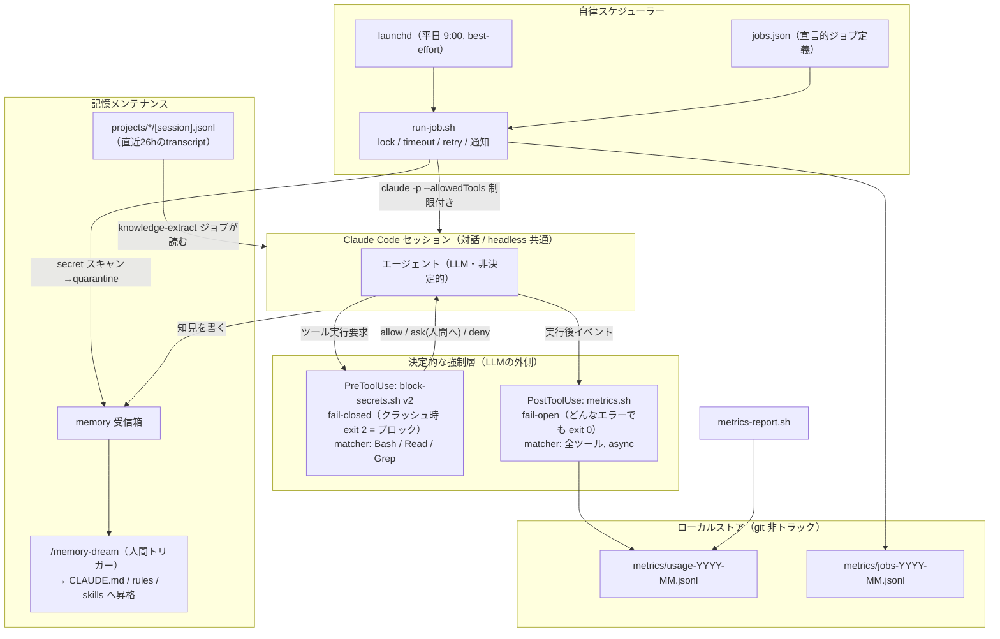
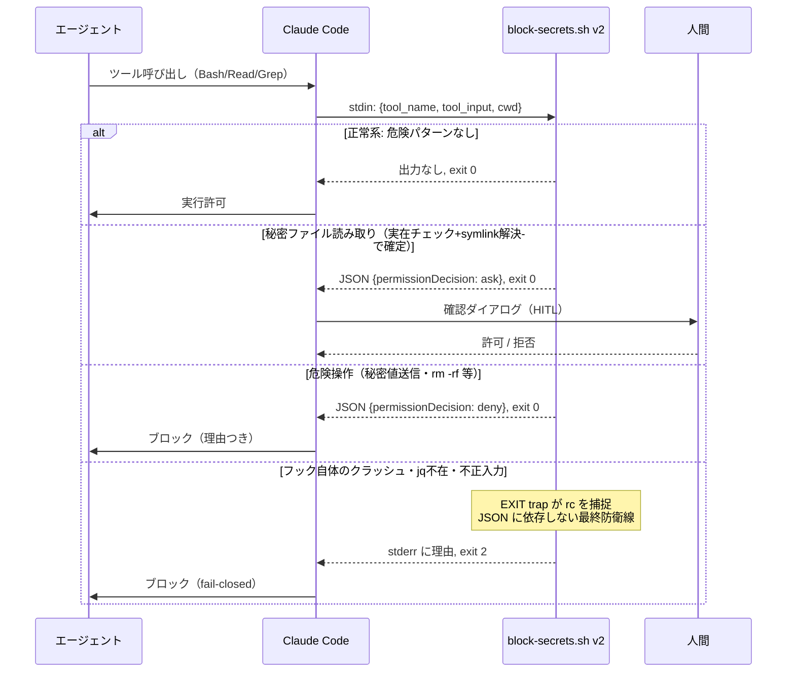
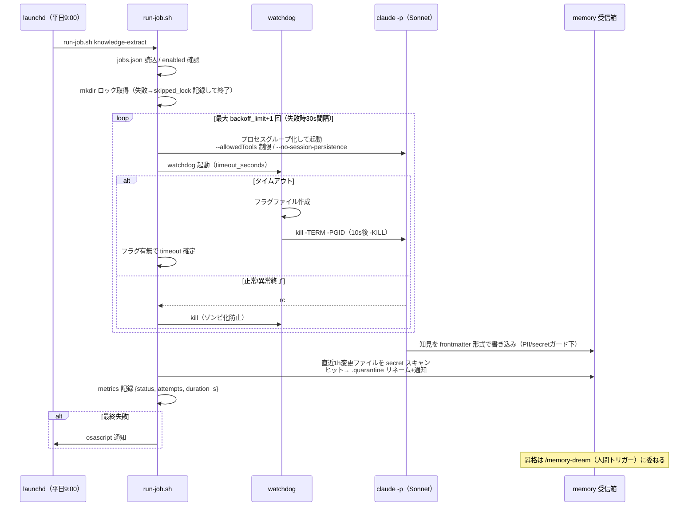

# ADR-0002: Ambient Agent Hardening（fail-closed hook / 計測 / 自律ジョブ）

Date: 2026-07-03
Status: Accepted

## Context

メルペイの常駐AIエージェント記事（https://engineering.mercari.com/blog/entry/20260630-28a5eee688/）の
中核概念をローカル Claude Code 環境に部品単位で再現する。対象は
(1) fail-closed セキュリティフック、(2) fail-open 計測フック、(3) ジョブ制御付き自律スケジューラー、
(4) 記憶の自動メンテナンス。

既存環境の課題:
- `hooks/block-secrets.sh` v1 は Bash のみ・fail-open・秘密ファイルの読み取りは素通し
  （読み取り系コマンドを明示的に免除していた）
- ツール/スキル利用の計測が存在しない
- `digest-runner.sh` + launchd はあるが timeout / retry / 多重起動抑止がない

## Architecture

設計の核（記事の再現ポイント）: 「何をやりたいか」は LLM、「やってよいか」「いつ動くか」は
決定的な層（hook / runner / launchd）に寄せる。安全側の層は fail-closed、計測の層は fail-open と、
層ごとに逆に倒す。

## Sequences

### PreToolUse フック（fail-closed）

### 自律ジョブ実行（run-job.sh）

## Decisions

### 1. セキュリティフックは fail-closed、計測フックは fail-open（層ごとに逆へ倒す）

- PreToolUse（安全）: フックがクラッシュしたら「黙って許可」でなくブロック。
  **最終防衛線は exit 2**（stderr が理由として渡り確実にブロックされる）。
  JSON の deny/ask（exit 0）はあくまで正常系の判定手段。
  理由: exit 0 + JSON なしは「判断なし=通常フロー」であり、trap 内で JSON 生成に失敗する
  深いクラッシュ時に fail-open になるため、JSON に依存しない exit 2 を最後の砦とする。
- PostToolUse（計測）: どんなエラーでも exit 0。計測がエージェントの動作を妨げてはならない。

### 2. 秘密ファイル読み取りは deny でなく ask

Mercari は human-in-the-loop なしの Slack bot なので deny 一択。
ローカル対話環境には人間がいるため `permissionDecision: "ask"` で人間に確認を出す。
正当な開発作業で .env を見たい場面を殺さない。
危険操作（秘密値の export / 送信、秘密ファイル書き込み、rm -rf）は従来通り deny。

### 3. 秘密パス検出は「実在チェック + symlink 解決」。能動的回避は塞がない

- 正規表現のみだと jq の `.fields.parent.key` や `process.env.X` を誤検知する。
  パス様トークンを抽出し cwd 基準で実在チェックして初めて ask にする。
- シンボリックリンクはリンク先も判定。glob / 最低限のブレース展開は展開して判定。
- **塞がないと決めた回避経路**: 変数展開（`F=.env; cat $F`）、base64/hex エンコードパス、
  コマンド置換の間接指定、送信を伴わない `env` 全ダンプ。
  理由: ask+HITL の脅威モデルでは人間が最終ゲート。能動的回避はプロンプトインジェクション時
  のみで、その場合も送信系 deny（v1由来）が部分的に効く。費用対効果が合わないため追わず、
  **既知の穴としてテストで挙動を固定**する。

### 4. 計測はローカル JSONL・git 非トラック

- `~/.claude/metrics/usage-YYYY-MM.jsonl`。外部サービス（Mercari の DX 相当）は使わない。
- パスに PII/プロジェクト情報を含むため git には載せない（whitelist gitignore で自然に除外）。
- 1行 4KB 未満を保証し `>>` 追記の実用的 atomic 性を確保（macOS に flock がない）。
- 月次ローテーション + 低確率トリガの自動掃除（6ヶ月超 gzip、12ヶ月超削除）。
- 価値は「何ができるか」でなく「何に使われているか」で測る（記事の採用ベース計測の踏襲）。

### 5. ジョブは宣言的 jobs.json + 汎用ランナー

- yq がないため YAML でなく JSON。timeout / backoff_limit / concurrency_policy を宣言し、
  ランナーがコードで保証する（記事の「単なる cron 以上」の再現）。
- timeout は coreutils timeout がないため bash 実装: プロセスグループ単位 kill +
  フラグファイルによる timeout 確定判定（wait 戻り値と kill の競合に依存しない）。
- launchd の StartCalendarInterval は**スリープ中は発火しない（best-effort）**。
  現時点で許容し、確実性が必要になったら pmset wake を検討。

### 6. ナレッジ抽出の出力先は memory 受信箱、昇格は /memory-dream

- 日次ジョブ（平日9:00）が前日 transcript から知見を抽出し auto memory（受信箱）に書く。
  恒久化の判断は既存の /memory-dream フローに委ねる（ADR-0001 と整合）。
- **secret ガードを二重化**: プロンプトで転記禁止を明示 + ジョブ完了後に runner が
  sync-config.sh と同じ secret 正規表現で当日変更の memory ファイルをスキャンし、
  ヒットは `.quarantine` にリネームして通知（git 昇格導線に secret を載せない）。

### 7. 一般化可能な知見は Obsidian PermanentNote へも昇格（高いバー付き）

- knowledge-extract は memory 受信箱への書き込みに加え、「一般化可能な原理・判断軸として
  人間が単体で読める」知見のみを `~/Desktop/Obsidian/Zettelkasten/PermanentNote/` に書く。
  feedback型・環境固有手順・(proposal) は対象外。日次で0件が正常。
- frontmatter に `source: claude-knowledge-extract` を必須とし、自動生成ノートを人間が
  識別・監査できるようにする。タグは vault の CLAUDE.md 規則（内容タグのみ・小文字・単数形）に従う。
- **残留リスク**: vault は obsidian-git が毎分自動 commit+push するため、runner の実行後
  secret スキャンは push に間に合わない可能性がある。よって検出時は vault 内リネームでなく
  vault 外（`~/.claude/.context/quarantine/`）へ移動し、「push済みの可能性があるので履歴確認」を
  通知する。一次防御はあくまでプロンプトの PII/secret ガード。

### 8. マルチPC同期は「git管理層のみ」を同期し、ローカル層は同期しない

仕組み・成果物ごとに同期経路が異なる:
- **hooks / scripts / jobs / ADR / settings.json**: `~/.claude` の git repo（Stop hook 自動同期）で
  全PCへ伝播。launchd への登録だけは PC ごとに1回 `install-launchd.sh` を手動実行
- **Obsidian PermanentNote**: vault 自体が git 同期（obsidian-git）なので自動で全PCへ伝播
- **memory 受信箱 / metrics**: 意図的にマシンローカル（ADR-0001 と本ADR Decision 4 の通り）。
  恒久知見は /memory-dream で git 管理層へ昇格することで結果的に同期される
- パスはユーザー名非依存化済み（ADR-0003）: settings.json / run-job.sh は `$HOME` ベース、
  launchd plist は `__HOME__` プレースホルダのテンプレートを install-launchd.sh が
  インストール時に絶対パス化する（launchd は plist 内の環境変数を展開しないため）

## Consequences

- フックのバグ = 全セッションの Bash/Read/Grep 停止のリスク。
  テストスイート全 green を settings.json 反映の条件とし、git 履歴で即ロールバック可能。
- Grep への ask が過多になる可能性。metrics で頻度を観測し、うるさければ matcher から
  Grep を外す（ロールバック手順あり）。
- 変数展開等の回避経路は意図的に未対応（Decision 3）。脅威モデルが変わったら再検討。

## Rollback

- Component 1: git 履歴から v1 復元 + settings.json matcher を "Bash" に戻す
- Component 2: settings.json から PostToolUse エントリ削除、metrics/ 削除
- Component 3: `launchctl bootout gui/$(id -u)/com.claude.job-knowledge-extract` + plist 削除。
  jobs.json の `enabled: false` で即時無効化も可
